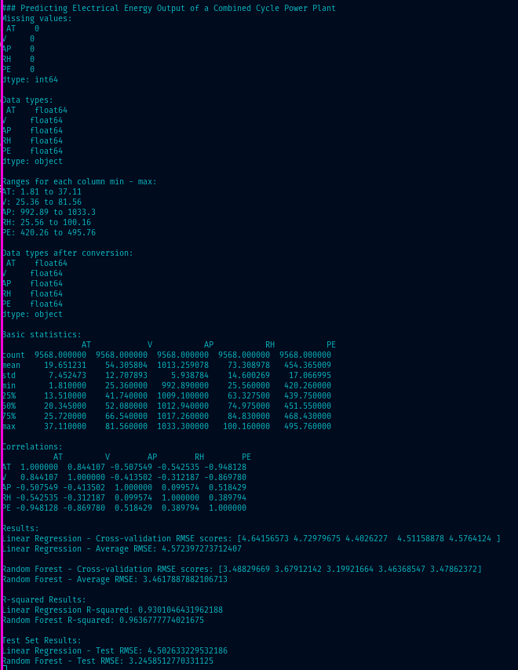

Origin: @w3bwizart

Category tags: #ai 

Content type tags: #type-Note  

Organization tags: #org-webwizart.be

Specific tags: 

---
### References
Duke University
https://www.coursera.org/learn/machine-learning-foundations-for-product-managers

This is an assignment of the first course.

A video can be found at https://youtu.be/liNrFCxHfJ0

---
# Title: Machine Learning Foundations for Product Managers
## Step-by-step Assignment instructions
### **Project topic:**

In this project we will build a model to predict the electrical energy output of a [Combined Cycle Power Plant](https://en.wikipedia.org/wiki/Combined_cycle_power_plant "Wikipedia - Combined Cycle Power Plant"), which uses a combination of gas turbines, steam turbines, and heat recovery steam generators to generate power. We have a set of 9568 hourly average ambient environmental readings from sensors at the power plant which we will use in our model.

The columns in the data consist of hourly average ambient variables: 
- Temperature (T) in the range 1.81°C to 37.11°C, 
- Ambient Pressure (AP) in the range 992.89-1033.30 milibar, 
- Relative Humidity (RH) in the range 25.56% to 100.16% 
- Exhaust Vacuum (V) in the range 25.36-81.56 cm Hg 
- Net hourly electrical energy output (PE) 420.26-495.76 MW (Target we are trying to predict)

The [dataset](https://storage.googleapis.com/aipi_datasets/CCPP_data.csv "Combined Cycle Power Plant Dataset") may be downloaded as a csv file. Note that Safari users may have to navigate to File -> Save As and select the option "Save as source" to download the file. Once you have downloaded the data, please review the Project Modeling Options reading and select a method of working with the data to build your model: 1) using Excel, 2) using Python, or 3) using Google AutoML.

### Data source:
Pınar Tüfekci, Prediction of full load electrical power output of a base load operated combined cycle power plant using machine learning methods, International Journal of Electrical Power & Energy Systems, Volume 60, September 2014, Pages 126-140, ISSN 0142-0615. 
Heysem Kaya, Pınar Tüfekci , Sadık Fikret Gürgen: Local and Global Learning Methods for Predicting Power of a Combined Gas & Steam Turbine, Proceedings of the International Conference on Emerging Trends in Computer and Electronics Engineering ICETCEE 2012, pp. 13-18 (Mar. 2012, Dubai)

### **Guidelines for the project:**
To complete the project, you must complete each of the below steps in the modeling process.
1. For the problem described in the Project Topic section above, determine what type of machine learning approach is needed and select an appropriate output metric to evaluate performance in accomplishing the task.
    
2. Determine which possible features we may want to use in the model, and identify the different algorithms we might consider.
    
3. Split your data to create a test set to evaluate the performance of your final model. Then, using your training set, determine a validation strategy for comparing different models - a fixed validation set or cross-validation. Depending on whether you are using Excel, Python or AutoML for your model building, you may need to manually split your data to create the test set and validation set / cross validation folds.
    
4. Use your validation approach to compare at least two different models (which may be either 1) different algorithms, 2) the same algorithm with different combinations of features, or 3) the same algorithm and features with different values for hyperparameters). From among the models you compare, select the model with the best performance on your validation set as your final model.
    
5. Evaluate the performance of your final model using the output metric you defined earlier.
    
Once you have completed all steps, create and record a brief (5 minutes maximum) presentation video describing your approach to each step. Your video must include a quick demo or screenshot of the final model you have created. In your video, be sure to clearly address the 4 elements on which your presentation will be evaluated.

### Process and solution
1. Check the data set to see if the data is complete or has missing values. 
	1. No missing values
	2. I converted the data to Float types
	3. The values are within the mentioned ranges
	4. Basic statistics
	5. Correlations
	   Correlation Heatmap
		1. AT (Temperature) has a strong negative correlation (-0.948128) with PE (Power Output)
		2. V (Exhaust Vacuum) has a strong positive correlation (0.869780) with PE
		3. AP (Ambient Pressure) has a moderate positive correlation (0.518429) with PE
		4. RH (Relative Humidity) has a moderate positive correlation (0.389794) with PE

    

	6. Scatter Plots
		- Temperature vs PE: Shows a negative trend (as temperature increases, PE decreases)
		- Ambient Pressure vs PE: Slight positive trend
		- Relative Humidity vs PE: No clear trend visible
		- Exhaust Vacuum vs PE: Positive trend (as vacuum increases, PE increases)
		   
2. Determine the type of machine learning problem.
   - This is a regression problem. We're trying to predict a continuous numerical value
   
3. Select appropriate evaluation metrics.
   - Given that we're predicting power output in MW, RMSE might be a good choice as it's interpretable in the same units as the target variable (MW). R-squared could also be useful to understand the overall fit of the model.
   
4. Identify potential features.
   - Based on the correlation matrix, we can see that Temperature (AT) and Exhaust Vacuum (V) have the strongest correlations with PE. These might be particularly important features in our model.
     
5. Select possible algorithm to use.
	- Multiple Linear Regression
	- Random Forest Regression
	  
6. Split data in Training and Test set.
	- Training set shape: (7654, 4)
	- Testing set shape: (1914, 4)

7. Choose validation strategy:
	- Cross-Validation
8. Implement chosen algorithms.
	- Multiple Linear Regression
	- Random Forest Regression
	  
9. Train and validate models.
   
10. Compare model performance.
	![[Pasted image 20240927015331.png]]
	-  Lower RMSE indicates better performance.
	- Random Forest consistently outperforms Linear Regression across all folds.
	- The scores are relatively consistent across folds, suggesting stable model performance.
	![[Pasted image 20240927015506.png]]
	- Random Forest performs better on unseen data.
	- The test set results are similar to the cross-validation results, indicating good generalization.
	  
11. Select best performing model.
12. Train the selected model on the entire training set.
13. Evaluate the model performance on test set.
14. Analyze the results and compare them to the validation performance.
15. Present results

# Final Report 

## Predicting Electrical Energy Output of a Combined Cycle Power Plant

## 1. Problem Definition and Approach

### Problem Type:
This is a regression problem aimed at predicting the continuous numerical value of Net hourly electrical energy output (PE) in MW.

### Evaluation Metric:
Root Mean Square Error (RMSE) is chosen as the primary metric because:
- It's interpretable in the same units as the target variable (MW)
- It penalizes larger errors more heavily, which is important for power output prediction

### Data Exploration:
- Dataset: 9568 hourly average ambient environmental readings
- No missing values found
- All variables converted to float type
- All values within specified ranges

## 2. Feature Selection and Algorithm Consideration

### Feature Analysis:
Based on correlation analysis and scatter plots:
1. Temperature (AT): Strong negative correlation (-0.948128) with PE
2. Exhaust Vacuum (V): Strong positive correlation (0.869780) with PE
3. Ambient Pressure (AP): Moderate positive correlation (0.518429) with PE
4. Relative Humidity (RH): Moderate positive correlation (0.389794) with PE

### Algorithms Considered:
1. Multiple Linear Regression
2. Random Forest Regression

Rationale: Comparing a simple linear model with a more complex ensemble method to capture potential non-linear relationships.

## 3. Model Development and Validation Strategy

### Data Splitting:
- Training set: 7654 samples (80%)
- Testing set: 1914 samples (20%)

### Validation Strategy:
5-fold cross-validation to ensure robust performance estimation

### Model Implementation and Comparison:
Both Linear Regression and Random Forest models were implemented and compared using:
1. Cross-validation RMSE scores
2. Test set RMSE
3. Predicted vs Actual plots
4. Residual plots

## 4. Results and Interpretation

### Model Performance:
Random Forest outperformed Linear Regression:
- Lower average RMSE in cross-validation (3.46 MW vs 4.57 MW)
- Lower RMSE on test set (3.25 MW vs 4.50 MW)
- Tighter clustering in Predicted vs Actual plot

### Feature Importance (Random Forest):
1. Temperature (AT): Highest importance
2. Exhaust Vacuum (V): Second highest
3. Ambient Pressure (AP) and Relative Humidity (RH): Lower importance

## 5. Results Based on our analysis: 

1. Model Performance: 
	- Random Forest outperformed Linear Regression: 
		- Lower average RMSE in cross-validation (3.46 MW vs 4.57 MW) 
		- Lower RMSE on test set (3.25 MW vs 4.50 MW) 
	- R-squared values: 
		- Linear Regression R-squared: 0.9301046431962188
		- Random Forest R-squared: 0.9636777774021675 
2. Feature Importance (Random Forest): 
	1. Temperature (AT): Highest importance 
	2. Exhaust Vacuum (V): Second highest 
	3. Ambient Pressure (AP) and Relative Humidity (RH): Lower importance 
3. Residual Analysis: 
	- Linear Regression: Residuals show a curved pattern, indicating unaccounted non-linear relationships. 
	- Random Forest: Residuals are more randomly scattered, suggesting better capture of data relationships. 

## 6. Conclusion 
The Random Forest model is superior for predicting the electrical energy output of the Combined Cycle Power Plant. Its ability to capture non-linear relationships between variables results in more accurate predictions compared to Linear Regression. 

### Key findings: 
1. Temperature and Exhaust Vacuum are the most critical factors influencing power output. 
2. The model's average prediction error is approximately 3.25 MW, about 0.7% of the average power output. 
3. Non-linear relationships in the data explain why Random Forest outperforms Linear Regression. 
 
### Practical implications: 
- Power plant operators should focus on monitoring and controlling Temperature and Exhaust Vacuum to optimize energy output. 

### Limitations and future work: 
1. Model performance in extreme conditions not represented in the dataset is uncertain. 
2. Future improvements could include: 
	- Collecting more diverse data 
	- Incorporating additional relevant features 
	- Exploring advanced algorithms (e.g., gradient boosting methods) 
	- Investigating feature interactions 

This project demonstrates the effectiveness of machine learning in predicting power plant output, potentially leading to improved efficiency and management of Combined Cycle Power Plants.